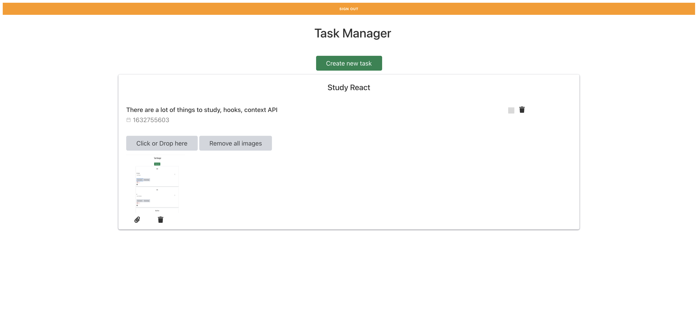
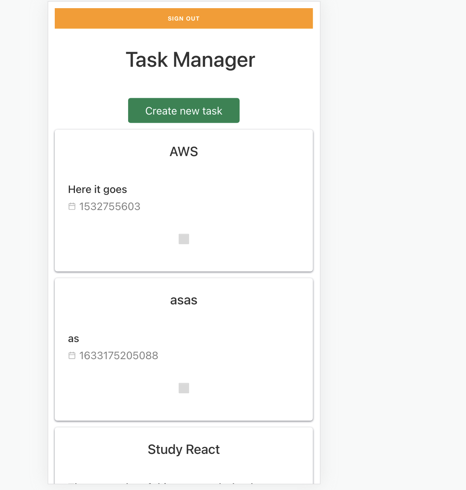

# Description

This is a simple application built using AWS Amplify. This application tracks the tasks. Tools that have been used are:-

1. React
2. AWS Lambda
3. DynamoDB
4. Cloudformation
5. API Gateway
6. AWS Cognito

A user first have to go through the authentication flow, register or sign into the application. Then he could create tasks, delete tasks, modify the status of those tasks, status can be either complete or open. The designs are responsive, it supports phone resolution as well. Image Library has also been built-in which they can utilise to add images to their tasks, though the images are not saved in backend for now but plan is there to store them.

# Some Screenshots

This is the entry point in the application.

Task screen in normal mode

Task screen in phone mode

# Possible Future scope

1.
